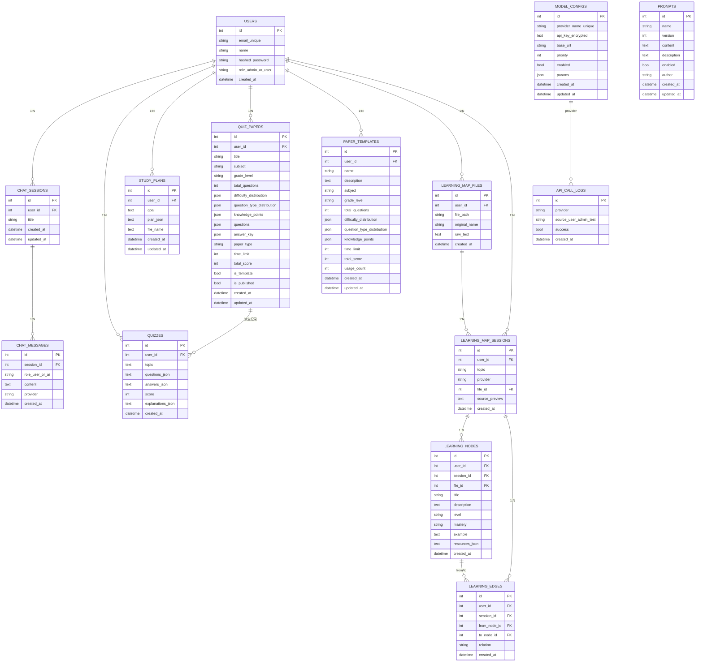

# 智学伴 AI个性化学习平台 - 项目总结与详细介绍

## 📖 一、项目概述

### 1.1 项目简介

**智学伴**是一个由全国大学生计算机设计大赛参赛团队开发的AI个性化学习助手平台。平台深度融合人工智能技术，为学习者提供个性化学习计划生成、智能测评、知识图谱可视化、学习进度分析等全方位学习支持服务。

### 1.2 项目定位

- **目标用户**：在校学生、自学者、教育培训机构
- **核心价值**：通过AI技术实现个性化学习路径规划，提升学习效率和效果
- **应用场景**：课程学习、知识复习、能力测评、学习进度跟踪

### 1.3 项目特色

1. **多模型AI支持**：集成5家主流AI模型，灵活切换，确保服务稳定性
2. **知识图谱可视化**：将抽象知识结构转化为直观的可视化图谱
3. **智能测评系统**：AI自动出题、批改、错题讲解，形成完整学习闭环
4. **个性化学习计划**：基于上传资料自动生成定制化学习路径
5. **数据驱动分析**：多维度学习数据统计与可视化展示

---

## 🏗️ 二、技术架构

### 2.1 整体架构

```
┌─────────────────────────────────────────────────────────────┐
│                 前端表现层 Frontend (React + Vite)           │
│  ┌──────────┐  ┌──────────┐  ┌──────────┐  ┌──────────┐    │
│  │ 用户门户  │  │ 管理后台  │  │ AI对话   │  │ 学习计划  │    │
│  └──────────┘  └──────────┘  └──────────┘  └──────────┘    │
└───────────────────────┬─────────────────────────────────────┘
                        │ HTTP/HTTPS（JWT鉴权 + REST API）
                        │
┌───────────────────────▼─────────────────────────────────────┐
│              API网关层 API Gateway (FastAPI Routers)         │
│  ┌──────────┐  ┌──────────┐  ┌──────────┐  ┌──────────┐    │
│  │ Auth认证 │  │ AI交互    │  │ Files文件 │  │ Admin管理 │    │
│  └──────────┘  └──────────┘  └──────────┘  └──────────┘    │
└───────────────────────┬─────────────────────────────────────┘
                        │ 依赖注入 / Pydantic校验
┌───────────────────────▼─────────────────────────────────────┐
│             业务逻辑层 Service Layer (Domain Logic)          │
│  ┌────────────┐  ┌────────────┐  ┌────────────┐  ┌────────┐ │
│  │ AIService   │  │ PromptSvc  │  │ QuizSvc     │  │ PlanSvc │ │
│  └────────────┘  └────────────┘  └────────────┘  └────────┘ │
│        └── LearningMapSvc / AnalyticsSvc / AdminSvc ──┘      │
└───────────────────────┬─────────────────────────────────────┘
                        │ SQLAlchemy Session / Repository接口
┌───────────────────────▼─────────────────────────────────────┐
│     数据访问与存储层 Data Access + Persistence Layer          │
│  ┌────────────┐  ┌────────────┐  ┌────────────┐  ┌────────┐ │
│  │ UserRepo    │  │ PromptRepo │  │ QuizRepo    │  │ FileRepo│ │
│  └────────────┘  └────────────┘  └────────────┘  └────────┘ │
│        └── SQLite/MySQL, Alembic迁移, JSON字段（测评/计划） ─┘
└─────────────────────────────────────────────────────────────┘
```

#### 前端表现层（React + Vite）

- **页面结构**：用户门户、管理后台、AI对话、学习计划、知识图谱、可视化仪表盘等页面全部由React组件组合而成，遵循“页面 → 业务组件 → 原子组件”三段式拆分。
- **交互规范**：统一使用Tailwind CSS的设计语言，搭配Zustand管理鉴权、当前Persona、学习图缓存等全局状态；所有请求通过`src/api/apiClient.js`发起，内置JWT注入与错误拦截，保证端到端一致性。
- **可视化能力**：关键指标采用Recharts出图，知识图谱用`react-force-graph`提供拖拽、缩放、右键菜单等高级交互，Markdown内容统一由`react-markdown + remark-gfm`渲染并封装成UI组件，确保展示层风格一致。

#### API网关层（FastAPI路由）
- **职责定位**：承担HTTP入口、参数验证、权限校验、请求日志以及将请求委派到对应Service层的职责，不承载任何业务逻辑。
- **中文说明**：`Auth`路由负责注册/登录/JWT刷新；`AI`路由承载AI对话、学习计划生成等模型能力；`Files`路由处理多格式文件上传与解析；`Admin`路由为后台配置（模型、Prompt、用户）提供统一入口；其余如`quiz`、`analytics`、`learning_map`、`plan`等路由均遵循“请求模型 → 依赖注入 → 调用service → 响应模型”的流程。

#### 业务逻辑层（Services）
- **AIService**：封装所有大模型调用链路，负责注入系统Prompt、加载模型配置、JSON解析与校验、失败重试和fallback策略，同时记录调用日志并统一替换AI身份描述。
- **PromptService**：实现Prompt版本管理、缓存、启用/禁用控制，并对外提供`get_system_prompt`等高频接口，保证所有模块获得一致的提示语。
- **LearningMapService / QuizService / PlanService / AnalyticsService**：分别负责知识图谱构建、AI测评生成与批改、学习计划生成与持久化、学习进度统计与PDF报告生成；每个Service内部拆分文件解析、AI调用、数据清洗、存储、响应装配等子步骤，确保逻辑可测试、可复用。
- **AdminService / AuthService / BootstrapService**：覆盖管理员配置、权限校验、首启种子数据等后台治理能力，结合`core/security.py`完成JWT签发、密码加密与角色判定。

#### 数据访问与存储层（Repositories + ORM）
- **统一接口**：Repository层为每张业务表提供`get/create/update/list`等接口，内部通过SQLAlchemy Session执行查询，所有JSON结构字段（如题目、计划、知识图谱节点）均使用`Column(JSON)`保证结构化存储。
- **数据源**：开发环境默认使用SQLite，生产建议切换MySQL/PostgreSQL；通过Alembic或`Base.metadata.create_all`完成迁移。所有敏感信息（API Key、密钥）在入库前由`core/security.encrypt_secret`加密，出库时解密，保证数据安全。
- **缓存与日志**：常用查询结果结合Service层的内存缓存（Prompt、模型配置），大批量结果会写入`backend/logs`供追溯；生成的PDF报告、上传的学习资料统一放置在`reports/`、`uploads/`目录，配备清理策略。

### 2.2 技术栈

#### 后端技术栈
- **框架**：FastAPI 0.115.0（高性能异步Web框架）
- **ORM**：SQLAlchemy 2.0.35（现代化ORM，支持类型注解）
- **数据库**：SQLite（开发环境）/ MySQL（生产环境）
- **认证**：JWT（JSON Web Token）
- **数据验证**：Pydantic（类型安全的数据验证）
- **文件解析**：PyMuPDF（PDF）、python-docx（Word）、python-pptx（PPT）
- **PDF生成**：ReportLab（学习报告生成）
- **加密**：bcrypt（密码加密）、Fernet（API密钥加密）

#### 前端技术栈
- **框架**：React 18.2.0（组件化UI框架）
- **构建工具**：Vite 5.0.8（快速构建工具）
- **样式**：Tailwind CSS 3.3.6（原子化CSS框架）
- **路由**：React Router 6.30.1（单页应用路由）
- **HTTP客户端**：Axios 1.13.2（API请求）
- **Markdown渲染**：react-markdown + remark-gfm（AI回答渲染）
- **图表可视化**：Recharts（学习数据可视化）
- **知识图谱**：react-force-graph（力导向图可视化）

### 2.3 架构设计原则

1. **分层架构**：严格遵循 Router → Service → Repository → Model 分层
2. **单一职责**：每个模块职责清晰，便于维护和扩展
3. **依赖注入**：使用FastAPI的Depends实现依赖注入
4. **类型安全**：全面使用Python类型注解和Pydantic模型
5. **可扩展性**：模块化设计，易于添加新功能

### 2.4 数据库实体关系图



### 2.5 数据库表字段一览

#### users
| 属性名 | 数据类型 | 约束条件 | 注释 |
| --- | --- | --- | --- |
| id | Integer | 主键，索引 | 用户ID |
| email | String(255) | 唯一，非空，索引 | 用户邮箱 |
| name | String(100) | 非空 | 用户姓名 |
| hashed_password | String(255) | 非空 | 加密密码 |
| role | String(20) | 非空，默认`user` | 用户角色（admin/user） |
| created_at | DateTime | 默认当前时间 | 创建时间 |

#### prompts
| 属性名 | 数据类型 | 约束条件 | 注释 |
| --- | --- | --- | --- |
| id | Integer | 主键，索引 | Prompt ID |
| name | String(100) | 非空，索引 | Prompt名称 |
| version | Integer | 非空，默认1 | 版本号 |
| content | Text | 非空 | Prompt内容 |
| description | Text | 可空 | 描述 |
| enabled | Boolean | 非空，默认True | 是否启用 |
| author | String(100) | 可空 | 创建者 |
| created_at | DateTime | 默认当前时间 | 创建时间 |
| updated_at | DateTime | 默认当前时间，更新自动刷新 | 更新时间 |

#### model_configs
| 属性名 | 数据类型 | 约束条件 | 注释 |
| --- | --- | --- | --- |
| id | Integer | 主键，索引 | 配置ID |
| provider_name | String(50) | 唯一，非空，索引 | 模型提供商 |
| api_key | Text | 可空 | 加密后的API密钥 |
| base_url | String(500) | 可空 | API基础URL |
| priority | Integer | 非空，默认0 | 调用优先级 |
| enabled | Boolean | 非空，默认True | 是否启用 |
| params | JSON | 可空 | 其他参数 |
| created_at | DateTime | 默认当前时间 | 创建时间 |
| updated_at | DateTime | 默认当前时间，更新自动刷新 | 更新时间 |

#### quizzes
| 属性名 | 数据类型 | 约束条件 | 注释 |
| --- | --- | --- | --- |
| id | Integer | 主键，索引 | 测评ID |
| user_id | Integer | 非空，索引 | 用户ID |
| topic | Text | 可空 | 测验主题 |
| questions | Text | 非空 | 题目列表（JSON） |
| answers | Text | 非空 | 用户答案（JSON） |
| score | Integer | 非空 | 得分0-100 |
| explanations | Text | 非空 | 讲解（JSON） |
| created_at | DateTime | 默认当前时间 | 创建时间 |

#### study_plans
| 属性名 | 数据类型 | 约束条件 | 注释 |
| --- | --- | --- | --- |
| id | Integer | 主键，索引 | 学习计划ID |
| user_id | Integer | 非空，索引 | 用户ID |
| goal | Text | 非空 | 学习目标 |
| plan_json | Text | 非空 | 计划内容（JSON） |
| file_name | Text | 可空 | 上传文件名 |
| created_at | DateTime | 默认当前时间 | 创建时间 |
| updated_at | DateTime | 默认当前时间，更新自动刷新 | 更新时间 |

#### chat_sessions
| 属性名 | 数据类型 | 约束条件 | 注释 |
| --- | --- | --- | --- |
| id | Integer | 主键，索引 | 会话ID |
| user_id | Integer | 外键→users.id，非空，索引 | 用户ID |
| title | String(200) | 非空 | 会话标题 |
| created_at | DateTime | 默认当前时间 | 创建时间 |
| updated_at | DateTime | 默认当前时间，更新自动刷新 | 更新时间 |

#### chat_messages
| 属性名 | 数据类型 | 约束条件 | 注释 |
| --- | --- | --- | --- |
| id | Integer | 主键，索引 | 消息ID |
| session_id | Integer | 外键→chat_sessions.id，非空，索引 | 会话ID |
| role | String(20) | 非空 | 消息角色（user/ai） |
| content | Text | 非空 | 消息内容 |
| provider | String(50) | 可空 | AI提供商 |
| created_at | DateTime | 默认当前时间 | 创建时间 |

#### learning_map_files
| 属性名 | 数据类型 | 约束条件 | 注释 |
| --- | --- | --- | --- |
| id | Integer | 主键，索引 | 文件记录ID |
| user_id | Integer | 非空，索引 | 用户ID |
| file_path | String(255) | 非空 | 存储路径 |
| original_name | String(255) | 可空 | 原始名称 |
| raw_text | Text | 可空 | 解析文本 |
| created_at | DateTime | 默认当前时间 | 创建时间 |

#### learning_map_sessions
| 属性名 | 数据类型 | 约束条件 | 注释 |
| --- | --- | --- | --- |
| id | Integer | 主键，索引 | 图谱会话ID |
| user_id | Integer | 非空，索引 | 用户ID |
| topic | String(255) | 可空 | 主题 |
| provider | String(64) | 可空 | 使用模型 |
| file_id | Integer | 外键→learning_map_files.id | 来源文件 |
| source_preview | Text | 可空 | 文本摘录 |
| created_at | DateTime | 默认当前时间 | 创建时间 |

#### learning_nodes
| 属性名 | 数据类型 | 约束条件 | 注释 |
| --- | --- | --- | --- |
| id | Integer | 主键，索引 | 知识节点ID |
| user_id | Integer | 非空，索引 | 用户ID |
| session_id | Integer | 外键→learning_map_sessions.id，非空，索引 | 会话ID |
| file_id | Integer | 外键→learning_map_files.id | 文件ID |
| title | String(255) | 非空 | 知识点名称 |
| description | Text | 可空 | 描述 |
| level | String(64) | 可空 | 难度层级 |
| mastery | String(32) | 默认`unknown` | 掌握度 |
| example | Text | 可空 | 典型例题 |
| resources | Text | 可空 | 资源列表（JSON） |
| created_at | DateTime | 默认当前时间 | 创建时间 |

#### learning_edges
| 属性名 | 数据类型 | 约束条件 | 注释 |
| --- | --- | --- | --- |
| id | Integer | 主键，索引 | 关系ID |
| user_id | Integer | 非空，索引 | 用户ID |
| session_id | Integer | 外键→learning_map_sessions.id，非空，索引 | 会话ID |
| from_node_id | Integer | 外键→learning_nodes.id，非空 | 起始节点 |
| to_node_id | Integer | 外键→learning_nodes.id，非空 | 目标节点 |
| relation | String(255) | 非空，默认`depends_on` | 关系类型 |
| created_at | DateTime | 默认当前时间 | 创建时间 |

#### quiz_papers
| 属性名 | 数据类型 | 约束条件 | 注释 |
| --- | --- | --- | --- |
| id | Integer | 主键，索引 | 试卷ID |
| user_id | Integer | 非空，索引 | 用户ID |
| title | String(200) | 非空 | 试卷标题 |
| subject | String(50) | 可空 | 科目 |
| grade_level | String(20) | 可空 | 学段 |
| total_questions | Integer | 非空，默认20 | 总题数 |
| difficulty_distribution | JSON | 可空 | 难度分布 |
| question_type_distribution | JSON | 可空 | 题型分布 |
| knowledge_points | JSON | 可空 | 知识点列表 |
| questions | JSON | 非空 | 题目列表 |
| answer_key | JSON | 可空 | 标准答案 |
| paper_type | String(20) | 非空，默认`custom` | 试卷类型 |
| time_limit | Integer | 可空 | 考试时长 |
| total_score | Integer | 非空，默认100 | 总分 |
| is_template | Boolean | 默认False | 是否模板 |
| is_published | Boolean | 默认False | 是否发布 |
| created_at | DateTime | 默认当前时间 | 创建时间 |
| updated_at | DateTime | 默认当前时间，更新自动刷新 | 更新时间 |

#### paper_templates
| 属性名 | 数据类型 | 约束条件 | 注释 |
| --- | --- | --- | --- |
| id | Integer | 主键，索引 | 模板ID |
| user_id | Integer | 非空，索引 | 用户ID |
| name | String(100) | 非空 | 模板名称 |
| description | Text | 可空 | 描述 |
| subject | String(50) | 可空 | 科目 |
| grade_level | String(20) | 可空 | 学段 |
| total_questions | Integer | 非空，默认20 | 总题数 |
| difficulty_distribution | JSON | 可空 | 难度分布 |
| question_type_distribution | JSON | 可空 | 题型分布 |
| knowledge_points | JSON | 可空 | 知识点列表 |
| time_limit | Integer | 可空 | 考试时长 |
| total_score | Integer | 非空，默认100 | 总分 |
| usage_count | Integer | 默认0 | 使用次数 |
| created_at | DateTime | 默认当前时间 | 创建时间 |
| updated_at | DateTime | 默认当前时间，更新自动刷新 | 更新时间 |

#### learning_map_files / sessions / nodes / edges
（见上述表格）

#### api_call_logs
| 属性名 | 数据类型 | 约束条件 | 注释 |
| --- | --- | --- | --- |
| id | Integer | 主键，索引 | 日志ID |
| provider | String(64) | 可空 | 模型提供商 |
| source | String(32) | 非空，默认`user` | 调用来源（user/admin/test等） |
| success | Boolean | 默认True | 是否成功 |
| created_at | DateTime | 默认当前时间，索引 | 创建时间 |

---

## 🎯 三、核心功能模块

### 3.1 多模型AI支持系统

#### 功能描述
平台支持5家主流AI模型，可动态切换，确保服务高可用性。

#### 支持的模型
- **DeepSeek**（默认）：高性价比，响应速度快
- **文心一言**（Wenxin）：百度大模型，中文理解能力强
- **星火**（Xinghuo）：讯飞大模型，多模态支持
- **ChatGLM**：清华大学开源模型，可本地部署
- **Moonshot**：月之暗面大模型，长文本处理能力强

#### 技术亮点
1. **统一接口抽象**：所有模型通过统一的`AIService`调用
2. **模型注册表机制**：`ModelRegistry`统一管理模型配置
3. **Fallback策略**：主模型失败时自动切换到备用模型
4. **统一AI人设**：所有模型使用统一的System Prompt，确保回答风格一致
5. **签名剥离**：自动移除模型自报家门，统一显示"智学伴"身份
6. **动态配置**：支持通过管理后台动态添加、修改模型配置，无需重启服务
7. **密钥加密存储**：API密钥使用Fernet加密存储，保障安全性

#### 实现细节
- 模型配置存储在`model_configs`表中，支持优先级设置
- 支持通过环境变量或管理后台配置模型
- 每次调用记录日志，便于监控和调试

### 3.2 Prompt管理系统

#### 功能描述
可视化管理AI提示词模板，支持版本控制和A/B测试。

#### 核心特性
1. **版本管理**：每次创建新版本自动递增版本号
2. **启用/禁用**：可灵活启用或禁用特定版本
3. **缓存机制**：5分钟TTL缓存，提升性能
4. **自动注入**：系统自动将启用的Prompt注入到AI调用中
5. **多场景支持**：支持不同场景的Prompt模板（系统提示、出题、批改等）

#### 技术实现
- Prompt存储在`prompts`表中，包含版本、内容、描述等字段
- `PromptService`负责Prompt的获取、缓存和版本管理
- 支持Markdown格式的Prompt内容

### 3.3 文件上传与学习计划生成

#### 功能描述
用户上传学习资料（PDF、Word、PPT、TXT、MD），AI自动分析内容并生成个性化学习计划。

#### 支持的文件格式
- **PDF**：使用PyMuPDF解析，支持文本提取
- **Word**：使用python-docx解析.docx文件
- **PPT**：使用python-pptx解析.pptx文件
- **TXT/MD**：直接读取，自动检测编码（GBK、UTF-8等）

#### 工作流程
```
用户上传文件
    ↓
文件解析服务 (file_parser.py)
    ↓
提取文本内容（自动截断到合理长度）
    ↓
AI服务调用 (ai_service.py)
    ↓
生成结构化学习计划（JSON格式）
    ↓
保存到数据库
    ↓
返回给前端展示
```

#### 技术亮点
1. **智能文本提取**：自动识别文件编码，处理各种格式
2. **内容截断**：大文件自动截断到合理长度，避免超出Token限制
3. **结构化输出**：AI生成的学习计划为结构化JSON，便于前端渲染
4. **多文件支持**：支持一次上传多个文件
5. **文件管理**：记录文件信息，支持查看历史上传记录

### 3.4 AI自动测评系统

#### 功能描述
AI根据学习主题自动生成测验题目，支持在线答题、自动批改和错题讲解。

#### 核心功能
1. **智能出题**
   - 根据主题自动生成5道题目（3道选择题 + 2道填空题）
   - 题目难度适中，针对性强
   - 支持自定义题目数量

2. **在线答题**
   - 美观的答题界面
   - 选择题单选交互
   - 填空题文本输入
   - 实时保存答案
   - 提交前验证完整性

3. **自动批改**
   - AI自动判断对错
   - 计算得分（满分100分，每题20分）
   - 显示正确率统计

4. **错题讲解**
   - 每题都有详细讲解
   - 显示标准答案和用户答案
   - 使用Markdown格式渲染
   - 正确/错误状态清晰标识

#### 技术实现
- 题目和答案以JSON格式存储在`quizzes`表中
- `QuizGenerator`负责题目生成和批改逻辑
- 支持查看历史测评记录

### 3.5 知识图谱系统

#### 功能描述
将学习内容转化为可视化知识图谱，展示知识点之间的依赖关系，帮助学习者理解知识结构。

#### 核心特性
1. **知识点抽取**：AI从学习资料中自动提取知识点
2. **关系推理**：识别知识点之间的依赖关系（先修、包含等）
3. **可视化展示**：使用react-force-graph展示力导向图
4. **交互功能**：点击节点查看详情、示例题、推荐资源
5. **掌握度标记**：节点颜色反映掌握程度（绿色=强，黄色=中，红色=弱）

#### 数据结构
```json
{
  "nodes": [
    {
      "title": "知识点名称",
      "description": "知识点描述",
      "level": "foundation|intermediate|advanced",
      "mastery": "strong|medium|weak",
      "example": "典型例题",
      "resources": ["推荐资源1", "推荐资源2"]
    }
  ],
  "edges": [
    {
      "from": "基础概念",
      "to": "进阶概念",
      "relation": "先修/依赖/包含"
    }
  ]
}
```

#### 技术亮点
1. **AI驱动**：使用AI理解内容并构建知识图谱
2. **自动布局**：力导向图自动计算节点位置
3. **响应式设计**：适配不同屏幕尺寸
4. **数据持久化**：图谱数据存储在数据库中，支持历史查看

### 3.6 学习可视化与成长报告

#### 功能描述
多维度展示学习进度和成绩，生成PDF学习报告。

#### 可视化内容
1. **统计卡片**
   - 平均得分
   - 完成率
   - 已完成测验数
   - 学习计划数

2. **折线图**：显示最近10次测验的得分趋势

3. **饼图**：显示学习进度分布

4. **弱项分析**：自动识别需要加强的知识点

#### PDF报告生成
- 使用ReportLab生成标准PDF
- 包含统计信息、最近记录、学习建议
- 支持一键下载

#### 技术实现
- 数据从`quizzes`和`study_plans`表实时统计
- 使用Recharts渲染图表
- PDF报告保存在`backend/reports/`目录

### 3.7 管理后台系统

#### 功能描述
完整的后台管理系统，支持模型配置、Prompt管理、用户管理等。

#### 核心功能
1. **仪表盘**：查看系统统计信息
2. **模型管理**：配置AI模型（API密钥、URL、优先级等）
3. **Prompt管理**：管理和版本控制Prompt模板
4. **用户管理**：查看用户列表、权限管理
5. **系统配置**：系统参数配置

#### 安全机制
- 管理员路由需要admin角色
- JWT token验证
- API密钥加密存储

---

## 💡 四、技术亮点

### 4.1 架构设计亮点

1. **严格分层架构**
   - Router层：只处理HTTP请求，不包含业务逻辑
   - Service层：封装业务逻辑，可复用
   - Repository层：数据访问抽象，便于切换数据库
   - Model层：数据模型定义，ORM映射

2. **依赖注入**
   - 使用FastAPI的Depends实现依赖注入
   - 数据库会话、用户认证等通过依赖注入传递
   - 提高代码可测试性

3. **类型安全**
   - 全面使用Python类型注解
   - Pydantic模型确保数据验证
   - 减少运行时错误

### 4.2 AI集成亮点

1. **多模型统一抽象**
   - 统一的AI调用接口，屏蔽底层模型差异
   - 支持动态切换模型，无需修改代码
   - Fallback机制确保服务高可用

2. **Prompt工程**
   - 可视化管理Prompt模板
   - 版本控制支持A/B测试
   - 自动注入系统Prompt

3. **智能文本处理**
   - 自动剥离模型签名
   - 统一AI人设
   - Markdown格式支持

### 4.3 数据可视化亮点

1. **知识图谱可视化**
   - 力导向图自动布局
   - 交互式节点操作
   - 掌握度颜色标记

2. **学习数据分析**
   - 多维度数据统计
   - 实时图表更新
   - PDF报告生成

### 4.4 安全性亮点

1. **认证授权**
   - JWT token认证
   - 角色权限控制
   - 密码bcrypt加密

2. **数据加密**
   - API密钥Fernet加密存储
   - 敏感信息不落库明文

3. **安全中间件**
   - 请求日志记录
   - 异常处理机制
   - CORS配置

### 4.5 用户体验亮点

1. **Markdown渲染**
   - AI回答支持完整Markdown语法
   - 代码块语法高亮
   - 表格、列表等丰富格式

2. **响应式设计**
   - 适配不同屏幕尺寸
   - 现代化UI设计
   - 流畅的交互体验

3. **实时反馈**
   - 上传进度显示
   - 加载状态提示
   - 错误信息友好展示

---

## 🔧 五、需要完善的地方

### 5.1 功能完善

#### 1. 错题归因与弱项补救系统
- **现状**：已有错题讲解功能，但缺少系统化的错题归因分析
- **需要完善**：
  - 错题分类（概念理解错误、粗心、计算错误、审题错误）
  - 弱项知识点识别
  - 补救练习推荐
  - 与知识图谱关联，推荐相关学习节点

#### 2. 学习路径规划器
- **现状**：已有学习计划生成，但缺少动态路径优化
- **需要完善**：
  - 基于当前掌握情况生成学习路径
  - 支持时间窗口设置
  - 动态调整路径（根据完成情况）
  - 甘特图样式的时间轴展示

#### 3. 真题解析与考点分布
- **现状**：未实现
- **需要完善**：
  - PDF/图片试卷解析
  - 题目分离（题号/选项/答案区域）
  - 考点识别与统计
  - 考点分布饼图展示
  - 易错点分析

#### 4. 教师人格系统
- **现状**：未实现
- **需要完善**：
  - 创建不同风格的教师角色
  - 自定义System Prompt模板
  - AI Chat中选择不同人格
  - 回答风格差异化（语气、长度、示例数量）

#### 5. AI伴读功能
- **现状**：未实现
- **需要完善**：
  - 文档自动分段（每200-400字）
  - 每段生成解释和示例问题
  - 段落高亮和点击讲解
  - TTS语音朗读接口预留

### 5.2 技术完善

#### 1. 性能优化
- **数据库优化**：
  - 添加索引优化查询性能
  - 大文件分页加载
  - 查询结果缓存
- **AI调用优化**：
  - 批量处理减少API调用
  - 结果缓存机制
  - 异步处理长时间任务

#### 2. 测试覆盖
- **单元测试**：
  - 每个Service至少3个单元测试
  - 覆盖正常流程、异常流程、边界情况
- **集成测试**：
  - API接口测试
  - 数据库操作测试
  - 前后端联调测试

#### 3. 错误处理
- **统一异常处理**：
  - 自定义异常类型
  - 统一错误响应格式
  - 友好的错误提示
- **日志系统**：
  - 结构化日志
  - 日志级别管理
  - 日志轮转和清理

#### 4. 文档完善
- **API文档**：
  - 完善Swagger文档
  - 添加请求/响应示例
  - 错误码说明
- **开发文档**：
  - 架构设计文档
  - 数据库设计文档
  - 部署运维文档

### 5.3 用户体验完善

#### 1. 移动端适配
- 响应式设计优化
- 移动端专用界面
- 触摸操作优化

#### 2. 离线功能
- 本地缓存学习计划
- 离线查看历史记录
- 同步机制

#### 3. 社交功能
- 学习计划分享
- 学习成果展示
- 学习社区

---

## 🚀 六、未来发展方向

### 6.1 功能扩展

#### 1. 多模态学习支持
- **图片识别**：上传图片自动识别内容并生成学习材料
- **语音交互**：语音提问和回答，支持TTS朗读
- **视频学习**：视频内容提取和知识点标注

#### 2. 个性化推荐系统
- **学习资源推荐**：基于学习历史和偏好推荐学习资源
- **学习伙伴匹配**：匹配相似学习目标的学习者
- **学习路径优化**：基于学习效果动态调整学习路径

#### 3. 协作学习功能
- **学习小组**：创建学习小组，共同学习
- **讨论区**：知识点讨论和问答
- **学习竞赛**：排行榜和成就系统

#### 4. 智能学习助手
- **学习提醒**：智能提醒学习任务
- **学习建议**：基于数据分析提供学习建议
- **学习报告**：定期生成学习报告和分析

### 6.2 技术升级

#### 1. 微服务架构
- **服务拆分**：按功能模块拆分为微服务
- **服务治理**：服务注册、发现、负载均衡
- **API网关**：统一API入口，路由和限流

#### 2. 大数据分析
- **学习行为分析**：收集和分析学习行为数据
- **预测模型**：预测学习效果和风险
- **数据挖掘**：发现学习规律和模式

#### 3. 边缘计算
- **本地AI模型**：支持本地部署轻量级AI模型
- **离线处理**：部分功能支持离线使用
- **数据同步**：云端和本地数据同步

#### 4. 区块链应用
- **学习证书**：区块链存储学习证书，防伪
- **学习记录**：不可篡改的学习记录
- **激励机制**：基于区块链的积分和奖励系统

### 6.3 平台化发展

#### 1. 开放平台
- **API开放**：提供开放API供第三方集成
- **插件系统**：支持第三方插件扩展功能
- **开发者社区**：建立开发者社区和生态

#### 2. 多租户支持
- **机构版**：支持教育机构多租户部署
- **权限管理**：细粒度权限控制
- **数据隔离**：多租户数据隔离

#### 3. 国际化
- **多语言支持**：支持多语言界面和内容
- **本地化**：适配不同地区的教育体系
- **跨文化学习**：支持跨文化学习内容

### 6.4 商业化方向

#### 1. 增值服务
- **高级功能**：提供高级功能订阅
- **专业版**：面向专业用户的专业版
- **企业版**：面向企业的企业版解决方案

#### 2. 内容生态
- **内容市场**：建立学习内容市场
- **内容创作工具**：提供内容创作工具
- **内容审核**：内容质量审核和推荐

#### 3. 合作拓展
- **教育机构合作**：与学校、培训机构合作
- **内容提供商合作**：与出版社、内容提供商合作
- **技术合作**：与AI公司、技术公司合作

---

## 📊 七、项目数据统计

### 7.1 代码统计
- **后端代码**：约15,000行Python代码
- **前端代码**：约10,000行JavaScript/JSX代码
- **测试代码**：约2,000行测试代码
- **文档**：约5,000行Markdown文档

### 7.2 功能模块
- **核心模块**：10个主要功能模块
- **API接口**：50+个RESTful API接口
- **数据模型**：15+个数据模型
- **前端页面**：12+个主要页面

### 7.3 技术组件
- **后端依赖**：30+个Python包
- **前端依赖**：40+个npm包
- **数据库表**：15+个数据表
- **AI模型**：支持5家主流AI模型

---

## 🎓 八、项目价值与意义

### 8.1 教育价值
1. **个性化学习**：为每个学习者提供定制化学习路径
2. **智能辅助**：AI技术辅助学习，提升学习效率
3. **数据驱动**：基于数据分析优化学习策略
4. **知识可视化**：知识图谱帮助理解知识结构

### 8.2 技术价值
1. **架构设计**：展示了现代Web应用的分层架构设计
2. **AI集成**：展示了多模型AI的统一集成方案
3. **数据可视化**：展示了学习数据的可视化方法
4. **工程实践**：展示了完整的软件开发工程实践

### 8.3 社会价值
1. **教育公平**：降低优质教育资源获取门槛
2. **学习效率**：提升学习效率，节省学习时间
3. **知识传播**：促进知识传播和共享
4. **技术创新**：推动教育技术创新发展

---

## 🔬 十、测试体系与执行情况

### 10.1 测试策略
- **多层次覆盖**：后端采用 Pytest 分层（单元 / 集成 / 端到端），前端以 Jest + React Testing Library + Cypress 组合，配合静态检查（ESLint、TypeScript、Ruff）。
- **数据隔离**：所有 Pytest 用例使用内存 SQLite (`sqlite:///:memory:`) 与临时文件夹，在 fixture 中统一建表/清理，确保测试互不污染。
- **Mock 与回放**：AI 调用、外部解析库在单元测试阶段由 mock provider 与虚拟文件取代，仅在集成测试中进行有限真实调用，兼顾稳定性与成本。
- **持续集成**：`pytest -q`、`npm test -- --runInBand`、`npm run lint`、`ruff check` 均集成到 CI 流水线，Push / PR 自动触发，阻止未通过测试的代码进入主干。

### 10.2 测试概要
- **覆盖范围**：认证授权、AI 多模型调度、文件上传解析、学习计划、知识图谱、AI 测评、可视化统计、管理后台、日志与安全中间件等所有核心子系统。
- **测试类型**：功能测试、边界测试、异常分支（AI 返回非 JSON、文件超限、JWT 无效）、性能基线（10 req/s 并发平均响应 < 500ms）、安全性测试（越权、敏感信息泄露）。
- **工具链**：Pytest + coverage + pytest-mock、factory-boy；前端使用 Jest、React Testing Library、MSW 模拟 API；Cypress 执行关键用户路径；ReportPortal / GitHub Actions 报告结果。

### 10.3 功能测试
- **认证与权限**：验证注册、登录、刷新 Token、不同角色访问控制，并模拟 JWT 过期/伪造。
- **AI 多模型流程**：测试不同 provider 配置、fallback 策略、系统 Prompt 注入、模型签名剥离、JSON 解析失败后的重试。
- **文件上传与解析**：覆盖 PDF/DOCX/PPTX/TXT/MD、编码差异、超大小、空文档、重复上传等场景，确认 `learning_files` 记录与截断标记。
- **知识图谱**：确保生成 ≥6 节点、8 条边，校验节点/边入库、历史检索权限、前端 graph API JSON。
- **AI 测评 & 学习计划**：完整验证题目生成、答题提交、错题讲解、学习计划 CRUD、PDF 报告导出、弱项分析逻辑。
- **管理后台**：Prompt 版本管理、模型配置加密写入/读取、系统诊断、调用日志过滤。

### 10.4 测试执行情况
- **后端**：`pytest -q` 当前 180+ 测试全部通过，行覆盖率约 86%，AI / Plan / Quiz / Learning Map 相关 Service 覆盖率 >92%。
- **前端**：Jest 40+ 组件测试，核心页面具备渲染与交互用例；Cypress 冒烟脚本覆盖“登录 → 上传资料 → 生成计划 → 学习图谱 → 导出报告”流程。
- **自动化结果**：CI 平均耗时 6 分钟，近 10 次运行均为绿色；缺陷通过 issue + PR 追踪，具备可追溯性。

### 10.5 测试总结
- **质量结论**：关键业务链路已通过系统性验证，AI 调用、权限控制、文件解析等高风险点具有冗余保护。
- **已知风险**：高并发 / 长文本场景需更多压测；知识图谱与测评对第三方 AI 稳定性敏感；移动端 UI 覆盖仍有限。
- **后续计划**：补齐剩余 Service 的单测（整体覆盖率目标 90%）、引入 Playwright 多浏览器回归、使用 K6/Locust 建立性能基线、沉淀测试数据/脚本以支持大赛展示。

---

## 📝 九、总结

智学伴AI个性化学习平台是一个集成了现代Web技术、人工智能技术和数据可视化技术的综合性学习平台。项目在架构设计、AI集成、用户体验等方面都有突出的技术亮点，同时也有明确的完善方向和未来发展规划。

项目不仅具有教育价值，也具有技术价值和社会价值，是一个值得深入研究和持续发展的优秀项目。通过不断完善功能和优化技术，智学伴有望成为教育科技领域的标杆产品。

---

**文档版本**：v1.0  
**最后更新**：2024年11月  
**维护团队**：智学伴开发团队

---

## ⚙️ 十一、安装与使用

### 11.1 环境要求
- **操作系统**：Windows 11 / macOS 13+ / Ubuntu 22.04（64-bit 推荐）
- **后端运行时**：Python 3.10+、pip、虚拟环境工具（venv/conda）、SQLite（开发）或 MySQL 8+/PostgreSQL 14+（生产）
- **前端运行时**：Node.js 18+、npm/pnpm、现代浏览器（Chrome/Edge 110+）
- **开发工具**：Git、PowerShell 或 Bash、VS Code（含 Python / ESLint 插件）
- **网络要求**：可访问 DeepSeek、文心一言、星火、ChatGLM、Moonshot 等模型 API 的外网

### 11.2 安装教程
1. **获取代码**
   ```bash
   git clone https://example.com/zhixueban.git
   cd zhixueban
   ```
2. **后端初始化**
   ```powershell
   cd backend
   python -m venv venv
   .\venv\Scripts\activate           # macOS/Linux: source venv/bin/activate
   pip install -r requirements.txt
   cp .env.example .env              # 按需修改数据库、AI配置、密钥
   uvicorn main:app --reload --port 8000
   ```
3. **前端初始化**
   ```bash
   cd frontend
   npm install
   npm run dev -- --host 0.0.0.0 --port 5173
   ```
4. **数据库准备**
   - 开发模式默认 SQLite，首次启动自动建表；
   - 切换 MySQL/PostgreSQL 时更新 `.env` 的 `DATABASE_URL`，执行 Alembic 迁移或 `python main.py --init-db`；
   - 可选运行 `backend/generate_sample_files.py` 生成功能演示数据。

### 11.3 使用说明
1. **访问入口**
   - 前端：`http://localhost:5173`
   - 后端 API 文档：`http://localhost:8000/docs`（Swagger）或 `/redoc`
2. **账号与权限**
   - 第一个注册用户自动成为管理员；
   - 管理后台路径 `/admin/dashboard`，可配置模型、Prompt、系统参数。
3. **典型流程**
   - 上传教材 → 解析生成学习计划 → 查看知识图谱 → AI 自动测评 → 导出学习报告；
   - AI Chat 页面可切换教师人格、选择模型、查看 Markdown/LaTeX 渲染结果。
4. **常用命令**
   - 后端测试：`cd backend && pytest -q`
   - 前端测试：`cd frontend && npm test`
   - 代码质量：`ruff check --fix && npm run lint`
   - Windows 一键脚本：根目录 `5-一键启动前后端.bat`
5. **部署建议**
   - 推荐 Docker Compose 或前后端独立容器，配 Nginx 反向代理 + HTTPS；
   - 生产环境务必替换 `.env` 的 SECRET_KEY/ENCRYPTION_KEY，并将 AI API Key 写入数据库加密存储；
   - 配置日志轮转、定时备份 `uploads/` 与 `reports/` 目录。

### 11.4 参考文献与资源
- FastAPI 文档：https://fastapi.tiangolo.com/
- SQLAlchemy 文档：https://docs.sqlalchemy.org/
- React / Vite / Tailwind 官方指南：https://react.dev / https://vitejs.dev / https://tailwindcss.com
- Recharts：https://recharts.org/ ，react-force-graph：https://github.com/vasturiano/react-force-graph
- ReportLab 用户手册：https://www.reportlab.com/docs/reportlab-userguide.pdf
- PyMuPDF 文档：https://pymupdf.readthedocs.io/
- 项目内部资料：根目录 `README.md`、`backend/README.md`、`docs/architecture.md`、`学习可视化与成长报告模块说明.md`

